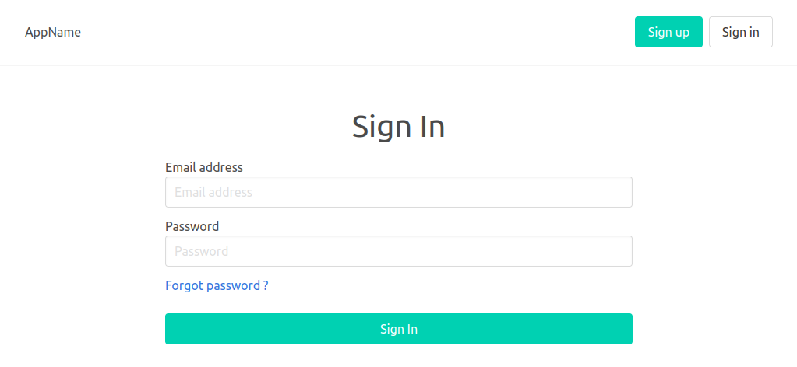
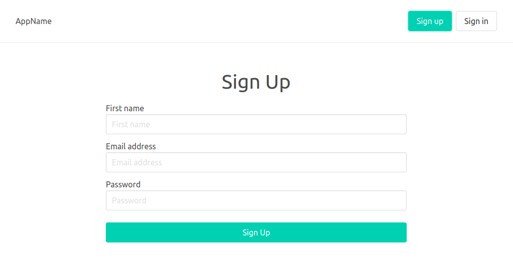
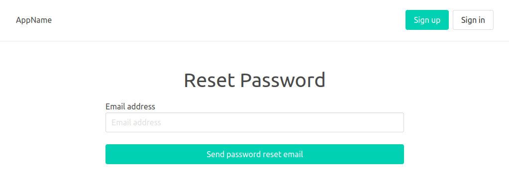

# Firebase Authentication

## 💻 Projeto

Projeto desenvolvido com base no vídeo [Firebase authentication with React, Redux and Typescript][video], oferecido por [CodingFromScratch][channel].

## 🛠 Tecnologias

As seguintes tecnologias foram utilizadas no desenvolvimento do projeto:

- [Bulma][bulma]
- [Firebase][firebase]
- [React][react]
- [React Redux][react-redux]
- [Typescript][typescript]

## 📷 Screenshots

<kbd>
  
</kbd>

<kbd>
  
</kbd>

<kbd>
  
</kbd>

[bulma]: https://bulma.io/
[channel]: https://www.youtube.com/channel/UCS2UjgEPEybOx1toY7aKRJg
[firebase]: https://firebase.google.com/
[react]: https://reactjs.org/
[react-redux]: https://react-redux.js.org/
[typescript]: https://www.typescriptlang.org/
[video]: https://www.youtube.com/watch?v=zPCeloCwPX8
